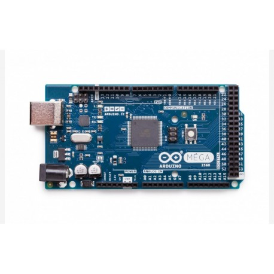
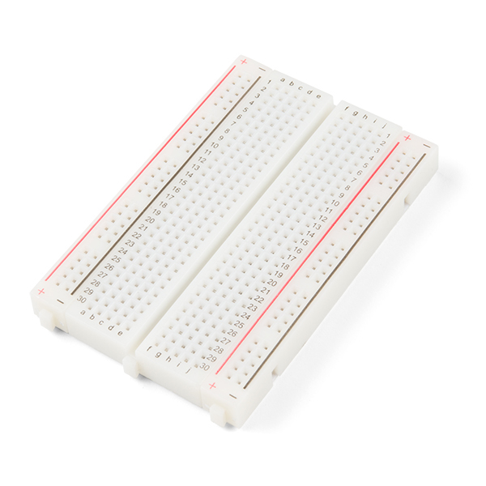
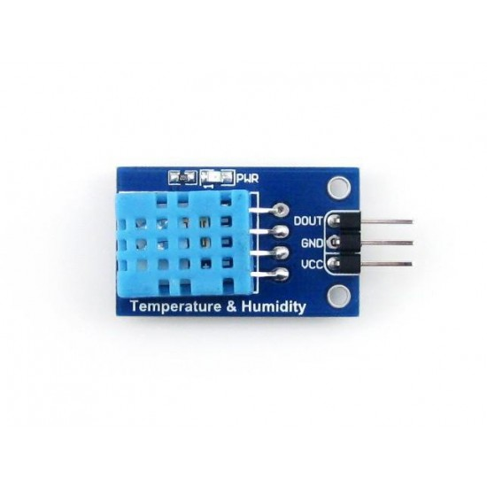
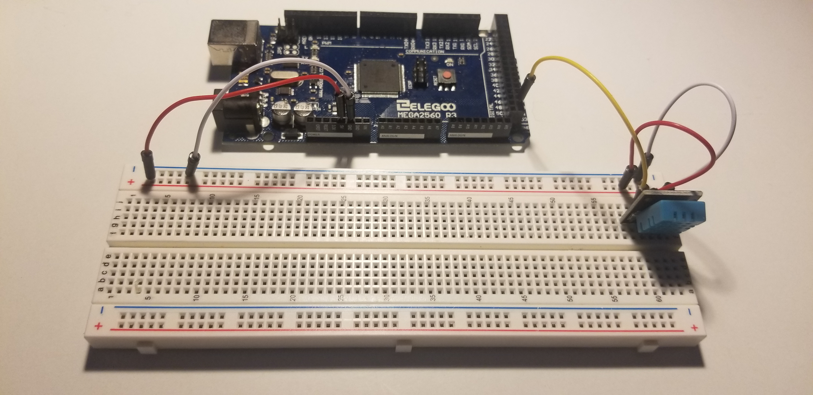
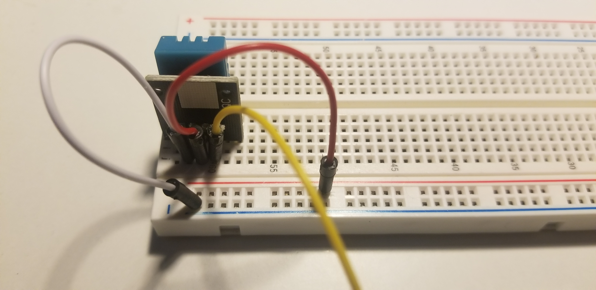
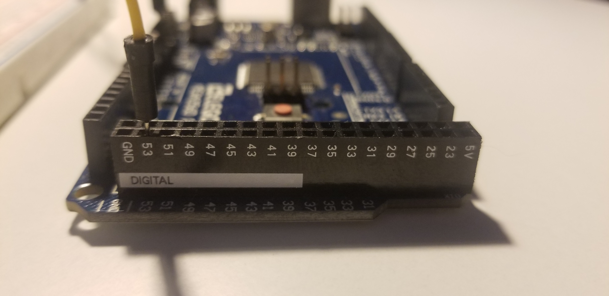

# WeatherStation
Récupération des données de température et d'humidité avec Arduino.

## Hardware

- Arduino Mega

- Fil
- Breadboard

- Capteur DHT11

## Branchement

## Code

Le code du projet se trouve dans le fichier weatherStation.ino
